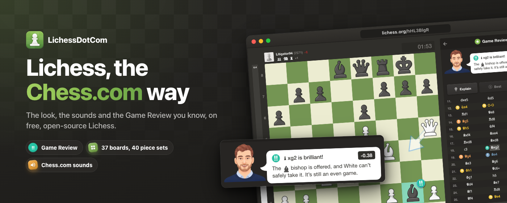
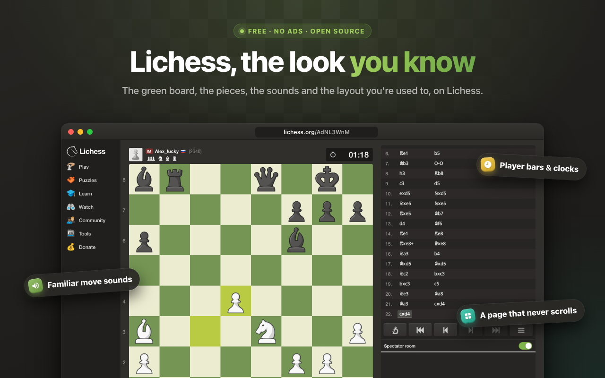
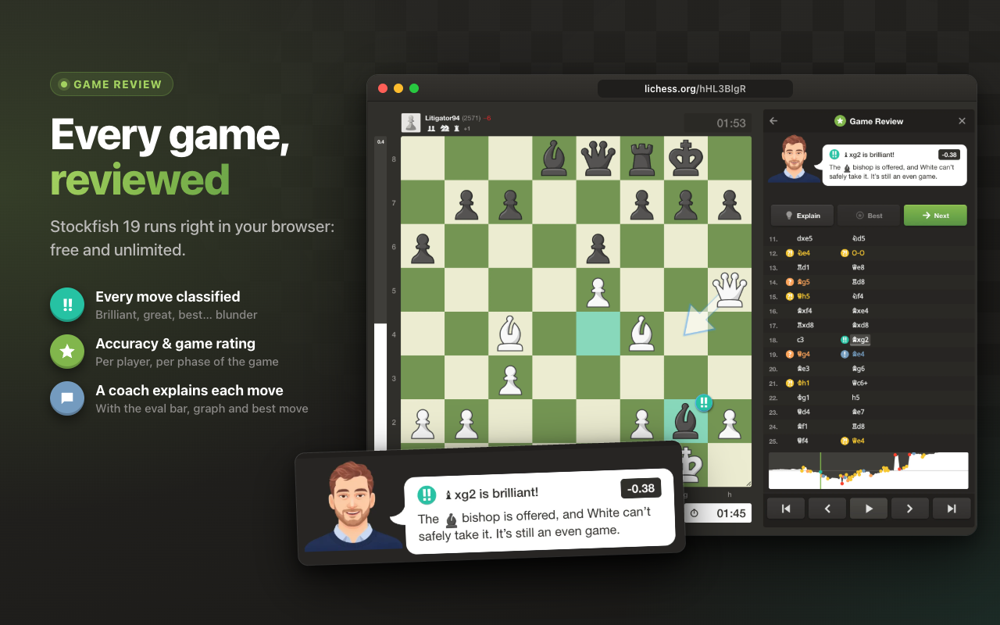
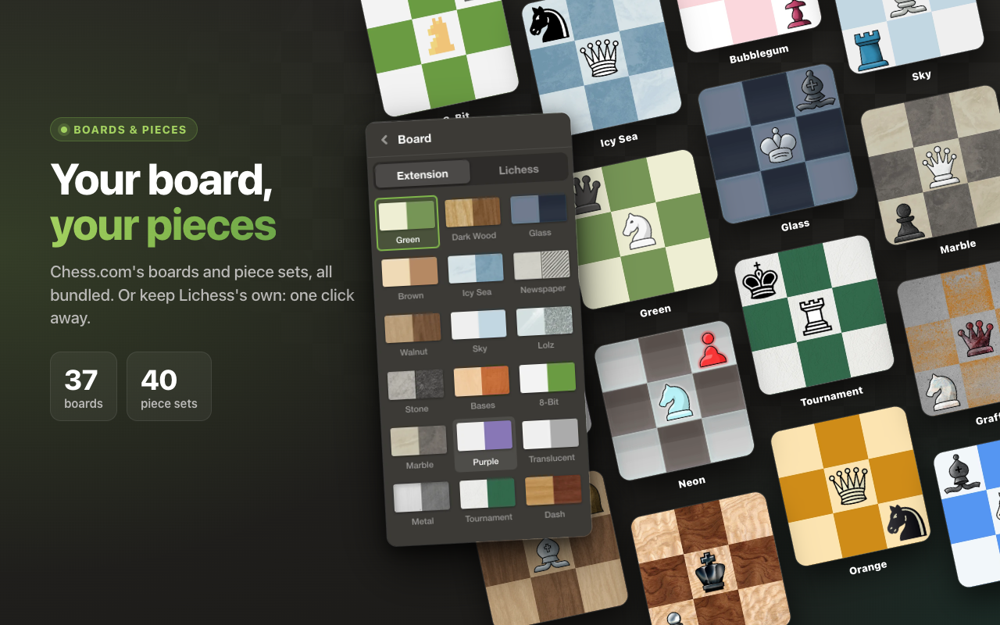
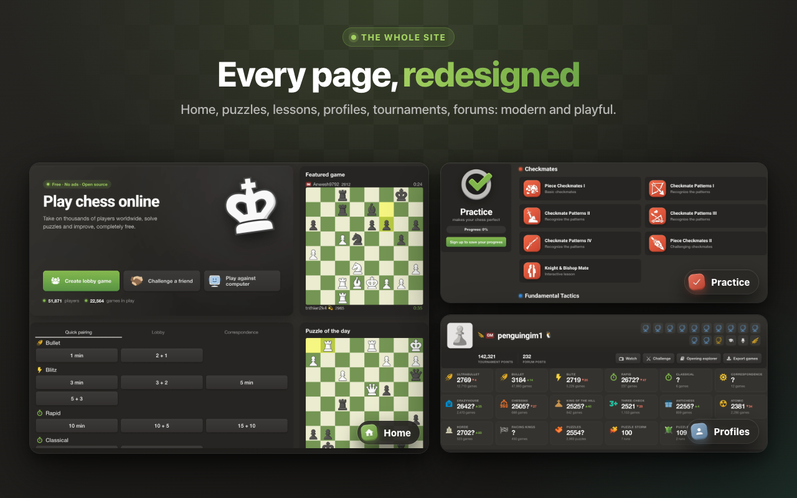

# LichessDotCom

Lichess is free, open source and has no ads. Chess.com is where a lot of us
learned to play, and its look is hard to give up. This Chrome extension gives
you both: Lichess, with the green board, the pieces, the sounds and the Game
Review of Chess.com.

Your Lichess account, your games and your friends don't change. Only the look
and the sounds do.

## What you get

### The Chess.com look

The green board and the Neo pieces, a sidebar on the left, player bars with
the clocks above and below the board, and one panel on the right for the moves
and the chat. A game fits on your screen, so there's nothing to scroll.

### A Game Review for every game

Open any finished game and you get a full review: each player's accuracy, a
rating for how well they played, and every move marked brilliant, great, best,
mistake, blunder… A coach then takes you through the game move by move.

The engine runs on your own computer, so it's free and there's no daily limit.

### Your board, your pieces

37 boards and 40 piece sets from Chess.com, or Lichess's own if you'd rather
keep them. Pick them in the settings menu, at the bottom of the sidebar.

### The rest of the site too

Home, puzzles, lessons, profiles, tournaments, the forum: every page gets the
same treatment.

## Install it

The extension isn't on the Chrome Web Store yet, so for now you add it by
hand. It takes a minute.

1. Download `LichessDotCom-v….zip` from the
   [latest release](https://github.com/theophile-wallez/LichessDotCom/releases/latest)
   and unzip it into a folder you'll keep.
2. In Chrome, open `chrome://extensions`.
3. Turn on **Developer mode**, top right.
4. Click **Load unpacked** and choose the unzipped folder (the one with
   `manifest.json` in it).
5. Open [lichess.org](https://lichess.org).

It also works in Edge, Brave, Arc, Opera and Vivaldi: the steps are the same,
from their own extensions page. Firefox and Safari aren't supported.

Leave the folder where it is: the browser loads the extension from it, so
moving or deleting it removes the extension.

**To update**, download the new release's ZIP and replace the folder's files with the
new ones. The extension reloads on its own the next time you go back to a
Lichess tab. If you cloned it with git, a `git pull` does the same.

**To remove it**, click **Remove** on its card in `chrome://extensions`.

## Good to know

- It's made for computers. In a narrow window or on a tablet you get Lichess's
  usual mobile layout, with the new colors, board and pieces.
- The sounds are downloaded from Chess.com the first time they're needed.
- Nothing is tracked or collected.
- This project isn't affiliated with Chess.com or Lichess. Chess.com's name,
  pieces and sounds belong to Chess.com.

Curious how it's built? [AGENTS.md](AGENTS.md) has the technical side.

## License

[MIT](LICENSE)
